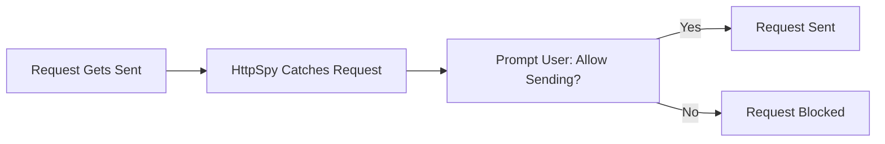

# Luau-HttpSpy
HttpSpy made in Luau that tracks requests being sent to an endpoint (GET, or POST)

```mermaid
graph LR
A[Request Gets Sent] --> B[HttpSpy Catches Request]
B --> C[Prompt User: Allow Sending?]
C -->|Yes| D[Request Sent]
C -->|No| E[Request Blocked]
```
